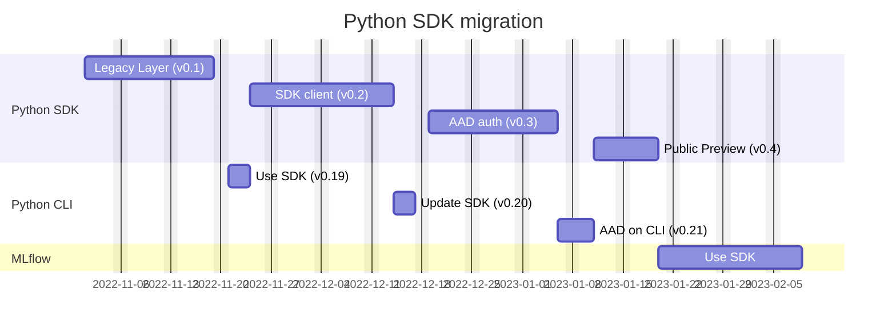
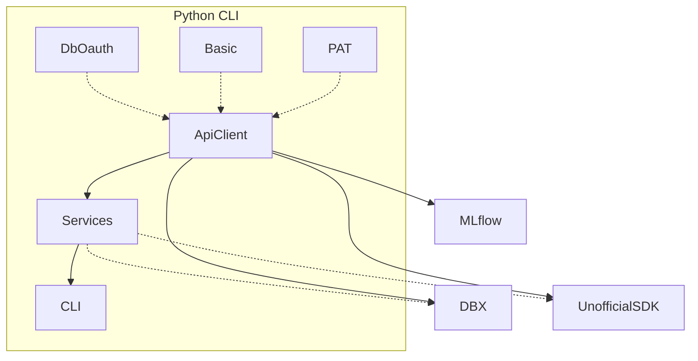
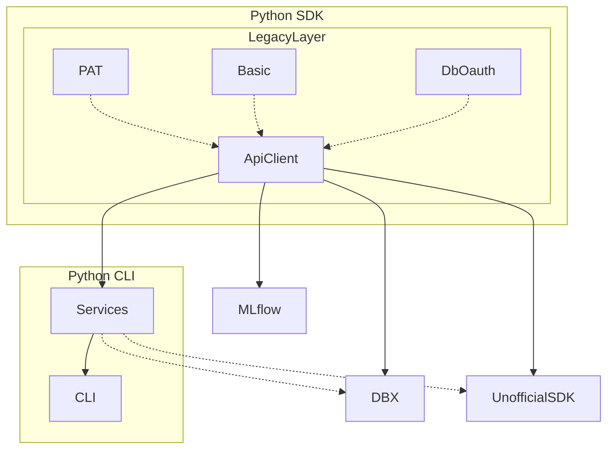
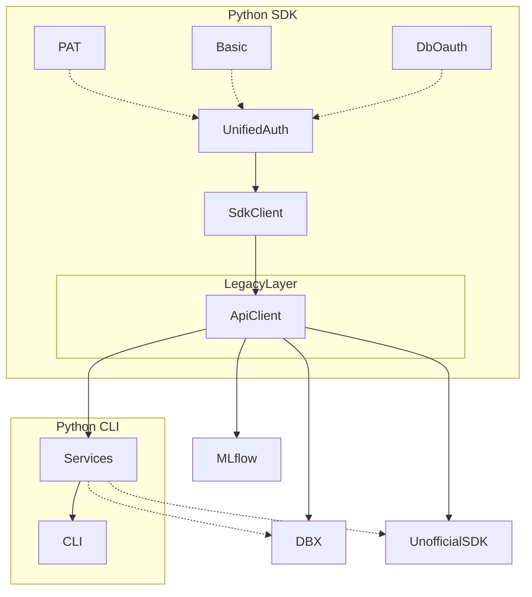
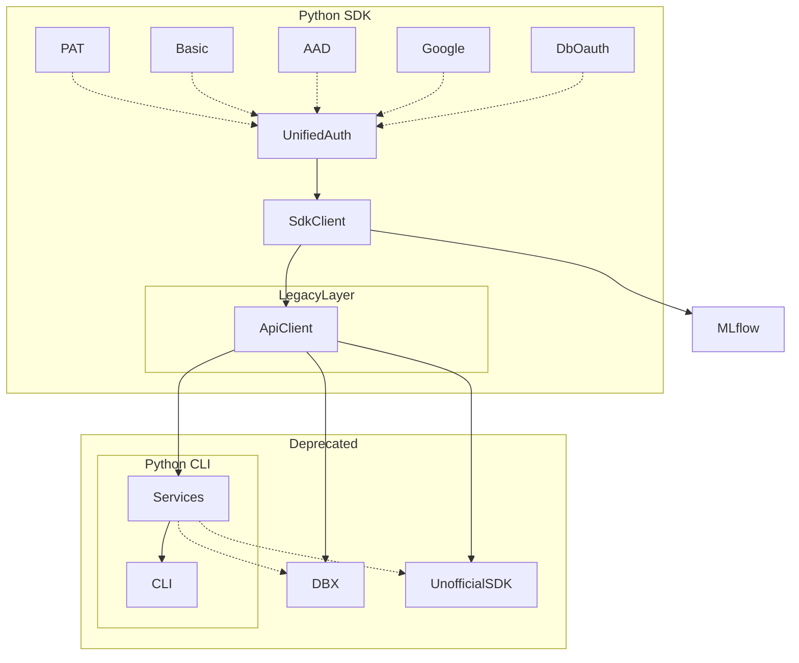

# Roadmap for Python

## Current State

## Python SDK v0.1, Databricks CLI v0.18.x

Essentially a copy of Python CLI as Legacy Layer.

If we remove hackathon-stability `DbOauth` from Python CLI for couple of months, we could simplify the effort.

## Python SDK v0.2, Databricks CLI v0.19.x

## End Goal

