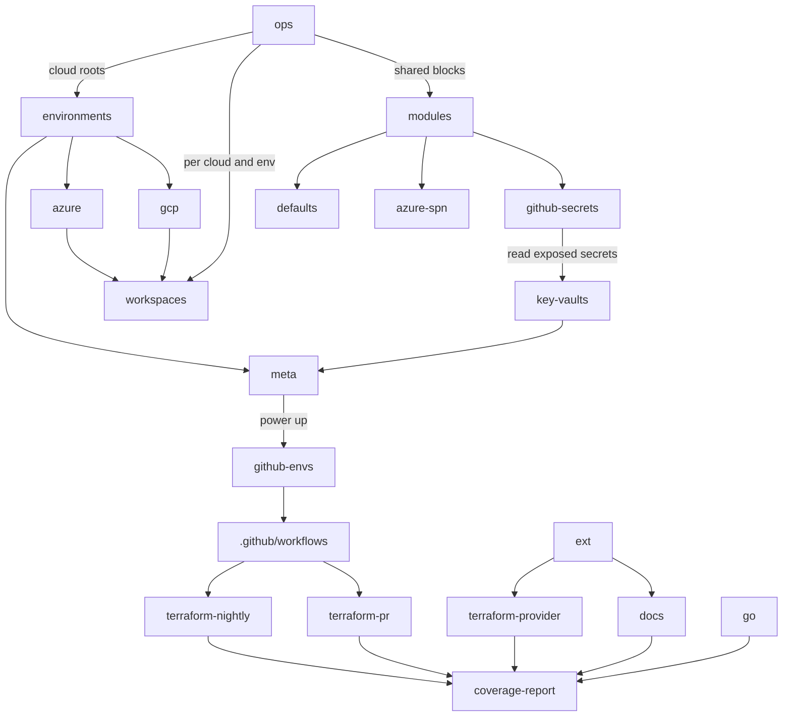

# eng-dev-ecosystem

See roadmpa for [Python](PYTHON_ROADMAP.md).

# infrastructure

Please install https://marketplace.visualstudio.com/items?itemName=bierner.markdown-mermaid and read https://mermaid-js.github.io/mermaid/#/gantt
