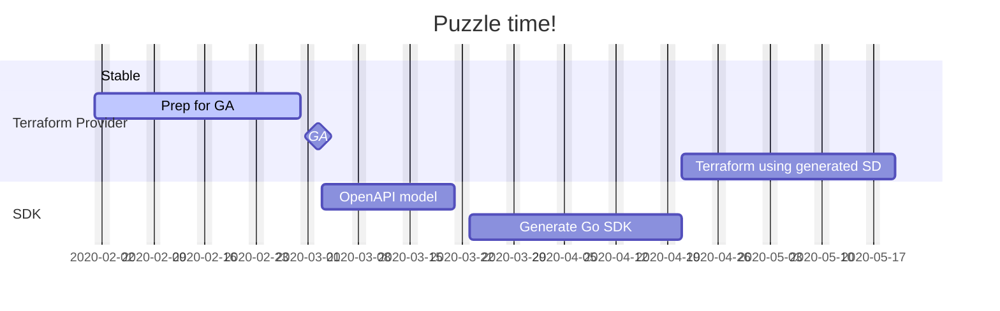

# eng-dev-ecosystem

# Roadmap

Please install https://marketplace.visualstudio.com/items?itemName=bierner.markdown-mermaid and read https://mermaid-js.github.io/mermaid/#/gantt

```mermaid
gantt
    dateFormat  YYYY-MM
    title       Puzzle time!
    excludes    weekends
    %% (`excludes` accepts specific dates in YYYY-MM-DD format, days of the week ("sunday") or "weekends", but not the word "weekdays".)

    section Terraform Provider
    Stable                          :done,      tf-stable, 2020-02-01,2022-05-01
    Prep for GA                     :active,    tf-prep, after tf-stable, 3w
    GA                              :milestone, tf-ga, after tf-prep, 1d
    Terraform using generated SD    :           tf-on-sdk, after go-sdk, 3w

    section SDK
    OpenAPI model : openapi, after tf-ga, 2w
    Generate Go SDK : go-sdk, after openapi, 3w

    section Bricks CLI

    section IDE Plugins

    section CI/CD

    section Legacy CLI
```