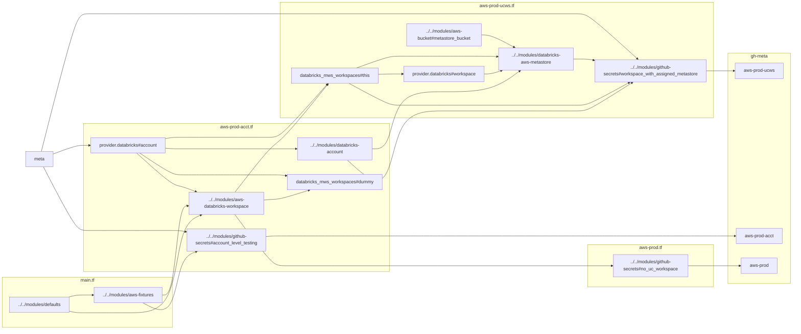

# AWS environments

```mermaid
graph LR

    subgraph main.tf
        ../../modules/defaults --> ../../modules/aws-fixtures
    end

    meta --> provider.databricks#account
    meta --> ../../modules/github-secrets#account_level_testing
    meta --> ../../modules/github-secrets#workspace_with_assigned_metastore

    subgraph aws-prod-acct.tf
        provider.databricks#account --> ../../modules/databricks-account

        provider.databricks#account --> databricks_mws_workspaces#dummy
        ../../modules/aws-databricks-workspace --> databricks_mws_workspaces#dummy

        ../../modules/aws-fixtures --> ../../modules/github-secrets#account_level_testing
    end

    subgraph aws-prod.tf
        provider.databricks#account --> ../../modules/aws-databricks-workspace
        ../../modules/aws-fixtures --> ../../modules/aws-databricks-workspace
        ../../modules/defaults --> ../../modules/aws-databricks-workspace

        ../../modules/aws-databricks-workspace --> ../../modules/github-secrets#no_uc_workspace
    end

    subgraph aws-prod-ucws.tf
        provider.databricks#account --> databricks_mws_workspaces#this
        ../../modules/aws-databricks-workspace --> databricks_mws_workspaces#this
        databricks_mws_workspaces#this --> provider.databricks#workspace

        ../../modules/aws-bucket#metastore_bucket --> ../../modules/databricks-aws-metastore
        databricks_mws_workspaces#this --> ../../modules/databricks-aws-metastore
        provider.databricks#workspace --> ../../modules/databricks-aws-metastore
        ../../modules/databricks-account --> ../../modules/databricks-aws-metastore

        ../../modules/databricks-aws-metastore --> ../../modules/github-secrets#workspace_with_assigned_metastore

        databricks_mws_workspaces#this --> ../../modules/github-secrets#workspace_with_assigned_metastore
        ../../modules/databricks-account --> ../../modules/github-secrets#workspace_with_assigned_metastore

    end


    subgraph gh-meta
    ../../modules/github-secrets#workspace_with_assigned_metastore --> aws-prod-ucws
    ../../modules/github-secrets#account_level_testing --> aws-prod-acct
    ../../modules/github-secrets#no_uc_workspace --> aws-prod
    end

```

- **aws-prod-oauth-m2m**: an environment for testing machine-to-machine authentication using Databricks service principals.
